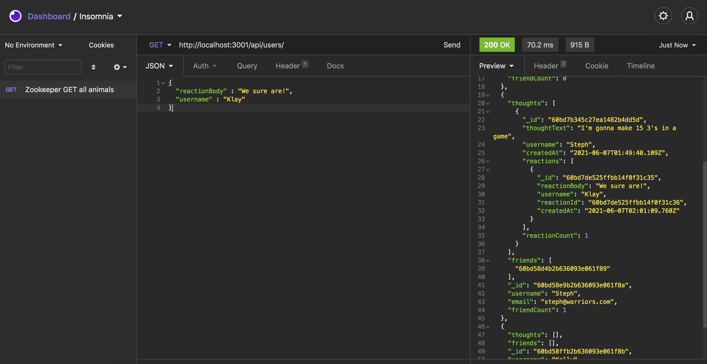

# Social Network

## Description 

A social media startup needs an API for their social network, using a NoSQL database, so I have created this repo to satisfy that request. 

This database can handle large amounts of unstructured data with flexibility and quickness. It will also satisfy the social media startup's technical acceptance requirements for their user stories. Users can share their thoughts, react to friends' thoughts, and create a friend list.

I have accomplished the goals of the social media startup by using Mongoose and Express to set up API routes. 

[GitHub Repository](https://github.com/Clayto30/social-network)

## Table of Contents (Optional)

* [Installation](#installation)
* [Usage](#usage)
* [Credits](#credits)
* [License](#license)

## Installation

Clone the repo onto your local device. At the root folder, run npm init in order to include the dependencies. Please have mongo db installed. You will be ready to run wild with my api routes and database!

## Usage 

Enter the command 'npm start' in invoke the application. The server starts and the Mongoose models will be synced to the MongoDB database.

You can use an app like Insomnia Core to test the api routes for users and thoughts. You can run all CRUD routes on these models. The data will be displayed and formatted as JSON. 

## Credits

This project was created as a project as part of the UC Berkeley Coding Bootcamp instruction. My instructor and especially those ever-helpful TA's deserve special recognition.

## License

Copyright 2021 Clayton Goff

Permission is hereby granted, free of charge, to any person obtaining a copy of this software and associated documentation files (the "Software"), to deal in the Software without restriction, including without limitation the rights to use, copy, modify, merge, publish, distribute, sublicense, and/or sell copies of the Software, and to permit persons to whom the Software is furnished to do so, subject to the following conditions:

The above copyright notice and this permission notice shall be included in all copies or substantial portions of the Software.

THE SOFTWARE IS PROVIDED "AS IS", WITHOUT WARRANTY OF ANY KIND, EXPRESS OR IMPLIED, INCLUDING BUT NOT LIMITED TO THE WARRANTIES OF MERCHANTABILITY, FITNESS FOR A PARTICULAR PURPOSE AND NONINFRINGEMENT. IN NO EVENT SHALL THE AUTHORS OR COPYRIGHT HOLDERS BE LIABLE FOR ANY CLAIM, DAMAGES OR OTHER LIABILITY, WHETHER IN AN ACTION OF CONTRACT, TORT OR OTHERWISE, ARISING FROM, OUT OF OR IN CONNECTION WITH THE SOFTWARE OR THE USE OR OTHER DEALINGS IN THE SOFTWARE.